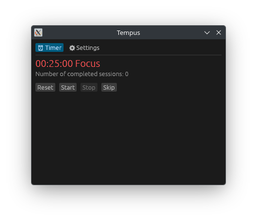
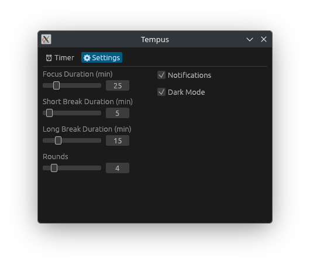

<p align="center">
  
  <h1 align="center">Tempus</h1>
  <p align="center">A simple Pomodoro timer for simple people</p>
</p>




## Features

- Built with **Rust** and **egui** for a **fast and responsive** experience
- A **simple Pomodoro timer** focused on helping you stay productive
- **Customizable** with **persistent settings** that are automatically saved
- **Desktop notifications** support

## Building from Source

### Prerequisites

Before building the application, make sure you have:

- Rust
- Git

### How to Build

1. Clone the repository

```bash
git clone https://github.com/mallei/Tempus.git
```

2. Enter the project directory

```bash
cd Tempus
```

3. Run the application

```bash
cargo run --release
```

4. Build the application

```bash
cargo build --release
```

The compiled application will be available in:

```text
target/release
```

## Built With

- egui
- Rust

## Contributing

Contributions are always welcome!

- Open an Issue
- Submit a Pull Request
- Suggest new features

## License

This project is licensed under the **GNU General Public License v3.0 (GPL-3.0)**.

See the [LICENSE](LICENSE) file for more information.
